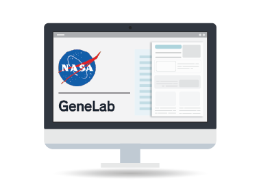
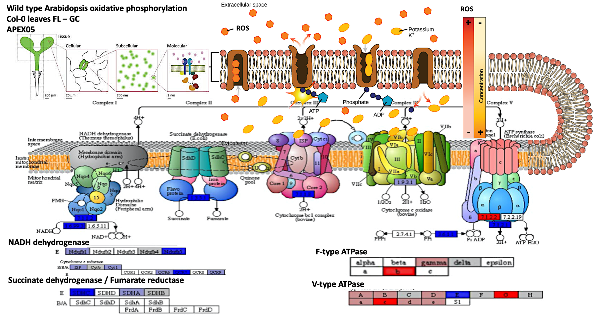

Preliminary analysis reveals some NASA data files produced by the GeneLab analysis
team that should be easy to open, combine and visualise. This website was created to
practice methods of presenting data analysis using GitHub to enable more
collaboration. Ultimately the **Space Biology and AstroBotany.io** repo has the goal
of making space biology data more **FAIR**. We aim to provide useful material for
integrating data from the NASA Open Science Data Archive (OSDR) into future
statistical analysis.

**Simple challenges and short-term goals to help you improve and enable new analysis**

## Get involved

- [Help develop the project wiki page](https://github.com/dr-richard-barker/Space_Biology_Education.io/wiki)
- [Help develop the website development road map](https://github.com/users/dr-richard-barker/projects/4)
- [Join the conversation on the repo discussion board](https://github.com/dr-richard-barker/Space_Biology_Education.io/discussions)

## The OSDR API demo notebook

This [Google Colab notebook](https://github.com/dr-richard-barker/Space_Biology_Education.io/blob/main/OSDR_API_demo_GLDS-37.ipynb)
pulls data from the GeneLab API. There are deliberate mistakes in the Python code that
prevent it from plotting PCA reduction or viewing expression data on KEGG pathways
correctly.

*Please help and see if you can fix the code!* It is currently designed to pull data
from an AstroBotany spaceflight experiment from the OSDR. Solve the challenges, use the
notebook, and share your progress by saving it back into
[this public repo](https://github.com/dr-richard-barker/Space_Biology_Education.io).

## Example questions

**Metadata summary**

- A. Is there a simple way to sort and summarize the metadata?
- B. Is there a way to quantify the similarity of the accessions based on their metadata?

**Multi-omics data**

- C. Is there a way to merge normalized counts for heatmaps?
- D. Is there a way to merge counts for statistical analysis?
- E. Is there a way to merge multi-omics data?

**Expression data**

- F. Is there a simple way to plot the normalized counts as a heat map?
- G. Can the `.html` and other results files be viewed in the Colab notebook?
- H. Is there a way to view the differential expression data on Reactome pathways?
- I. Is there a way to perform gene-set enrichment analysis of differentially expressed loci?
- J. Is there a way to perform PCA, K-means and t-SNE clustering to identify functionally related co-expression clusters?

## Adding Sci-Art to present data more insightfully

This prototype figure was made for artistic merit. It uses data projected onto a KEGG
pathway that was then customised in Adobe Photoshop to aid narrative development around
changes in membrane transport. There are several scientifically relevant presentation
issues with this figure — primarily it lacks a colour scale showing that red is up and
blue is down in gene expression. The blurry text and inability to evolve the figure
further highlight the long-term advantages of notebook-embedded data-visualisation.
